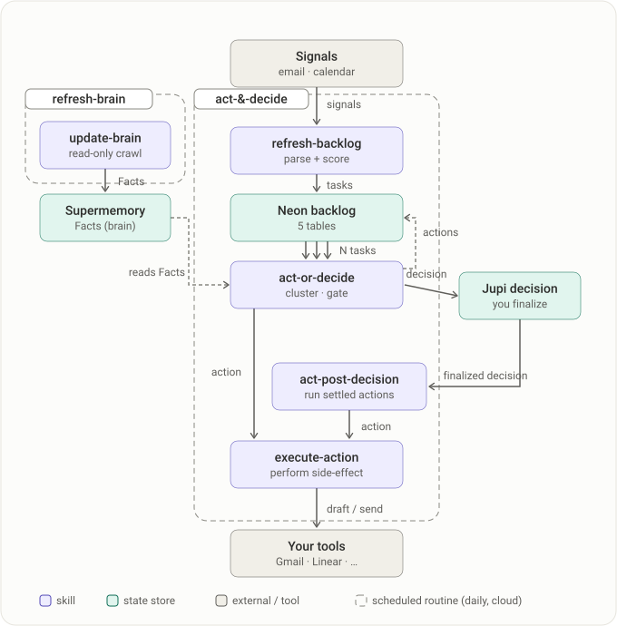

# Proactive-Jupi

Workspace + skills for the Proactive-Jupi engine.

## What it does
`Signals → scored Tasks (backlog) → act-or-decide → Actions / Decisions → execute (closing loop)`.
The human is bothered **only for genuine decisions** (the confidence × risk gate). Everything confident-and-safe just happens.

## Architecture

Two scheduled routines (daily, cloud). **refresh-brain** crawls your tools into the Supermemory brain; **act-&-decide** works the backlog: parse + score signals into Neon, then either act (draft/send) or raise a decision in Jupi for you to finalize. Boxes say what each skill does; arrows carry the entity that flows.

<p align="center"></p>

State lives in three stores — **Neon** (tasks + actions), **Jupi** (decisions + lifecycle), **Supermemory** (Facts). Neon holds five tables; here is who reads and writes each, and how the refresh-brain routine uses `crawl_state` (its cursor) and `crawl_frontier` (drained into Facts).

<p align="center"></p>

## Get started

In the **Claude Desktop app**, every step below is under **Cowork → Customize → Plugins**.

**1. Add the jupi-skills marketplace** — **Add → Add marketplace**, then paste:

```
https://github.com/jupi-co/jupi-skills.git
```

Skip this if `jupi-skills` is already in your marketplace list.

**2. Add this marketplace** — **Add → Add marketplace** again, with:

```
https://github.com/jupi-co/proactive.git
```

**3. Install `proactive-jupi`** from the `proactive-jupi` marketplace. `jupi-skills` installs alongside it as a dependency.

**4. Connect to the Jupi MCP server** Under the Connectors tab of the installed plugin, click "Jupi" then "Connect".

**5. Run setup** in the workspace you want Proactive-Jupi to work in by starting a Cowork task and prompting:

```
/setup-proactive-jupi
```

Setup front-loads everything human-gated into an attended prelude — config keys, OAuth consents, questions about your stack and tools, and the Neon credential + egress probe — behind a `✋ needs-you done` boundary. Steps after that boundary run unattended. Budget ~15 minutes and stay at the keyboard until you see it.

> **Allowlist Neon's hosts first.** Proactive-Jupi reaches Neon over HTTPS, and databases live on per-project `*.aws.neon.tech` hosts. If your environment restricts network egress, allow **`*.aws.neon.tech`** (and **`*.neon.tech`**) under **Admin settings → Capabilities → network access** before running setup, so the egress probe clears on the first try.

**Testing an unreleased build? (Developer mode)** 
- Clone the repo
- Ask an AI agent to package the plugin, or run `bash scripts/package-plugin.sh`
- Upload `dist/proactive-jupi.zip` under **Plugins → Add → Upload local plugin**. A zip upload carries no dependency resolution, so install `jupi-skills` yourself first.

## Config — two files, two jobs

Both are gitignored; each has a committed template. **Neither ever names a tool** — which tool plays which role lives in `.proactive-jupi/assets.md` (the roles table: `inbox`, `context`, `work`, `decision`, `rules`, `brain`).

| File | Holds | Template | Who reads it |
|---|---|---|---|
| `.proactive-jupi/config.local.json` | Per-workspace **ids/secrets** to reach a store (`jupiUserId`, `neonConnString`, `rulesStoreRef`, …) + **settings/thresholds** (`crawlWindowDays`, `ruleThreshold`, `guardrails`, …) | [`…/reference/config.template.json`](plugins/proactive-jupi/skills/setup-proactive-jupi/reference/config.template.json) — setup copies it in and collects missing keys | The skills, at runtime |
| `.proactive-jupi/.env` | **Dev-tooling secrets for this repo only** (`SUPERMEMORY_API_KEY`) | [`.proactive-jupi/.env.template`](.proactive-jupi/.env.template) — `cp .proactive-jupi/.env.template .proactive-jupi/.env` | Repo scripts you run by hand (`evals/*/purge-scratch.sh`, ad-hoc HTTP-API ops) |

The Supermemory key is deliberately **not** in `config.local.json`: that file is mirrored into unattended/cloud run CWDs, so an admin-scoped key would travel with every scheduled routine. The runtime never needs it — the skills reach Supermemory through the installed MCP connector.

## Where state lives
| Store | Home |
|---|---|
| Facts & relationships | **Supermemory** |
| Asset Map (roles: which tool to use, when) | **`.proactive-jupi/assets.md`** |
| Task backlog + actions | **Neon Postgres** (schema: `plugins/proactive-jupi/skills/setup-proactive-jupi/reference/schema.sql`) — every row keyed by `user_id` = the **Jupi user id** (same identity as the brain's container tag) |
| Decisions + lifecycle (incl. EXECUTED) | **Jupi** |

## Skills (in the plugin)
- **`plugins/proactive-jupi/skills/setup-proactive-jupi`** — cold-start a workspace (connect tools, discover assets, apply the Neon schema, seed the brain, init backlog, cadence + guardrails). **Built.** Invoke with `/setup-proactive-jupi` once the plugin is installed.
- **`plugins/proactive-jupi/skills/update-brain`** — the brain crawler: reads tools (read-only), writes Facts to Supermemory via the connector, incremental via the Neon `crawl_state` cursor. **Built.** Modes: `full` / `targeted`.
- `plugins/proactive-jupi/skills/act-or-decide` — the automation pipeline. *(next)*

## Plugin (local Cowork testing)
`proactive/` is packaged as a Claude plugin (marketplace `proactive-jupi`, plugin `proactive-jupi`), following jupi-skills.
- **Build:** `bash scripts/package-plugin.sh` → `dist/proactive-jupi.zip` (gitignored).
- **Validate:** `bash scripts/validate-plugin.sh` (fails on an invalid manifest or `<…>` tags in a skill description — Cowork rejects those).
- **Auto-build on commit:** `bash scripts/install-hooks.sh` once; the `post-commit` hook then validates + rebuilds `dist/*.zip`.
- **Test in Cowork:** Claude Desktop → Cowork → Customize → Plugins → Personal → **+** next to "Local uploads" → select `dist/proactive-jupi.zip` (keep the `.zip` extension).

## Status
Phase 0. `setup-proactive-jupi` + `update-brain` skills built + packaged (`dist/proactive-jupi.zip`); Neon schema (`tasks`, `actions`, `crawl_state`) applied to project `sparkling-violet-42081696`; Supermemory connected (connector-simple). **Next:** the `act-or-decide` engine.
